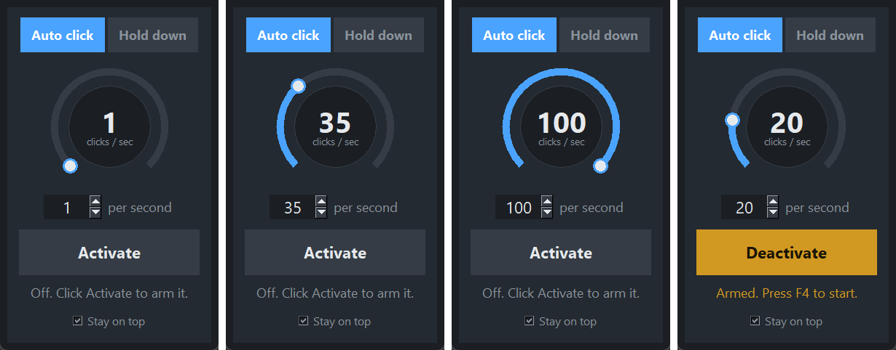

# Clicker

A small desktop auto-clicker with a safety. Replaces the old Speed Clicker.

## Use it

Double-click `run.bat`.

1. Pick a mode:
   - **Auto click**: clicks the left button over and over at the speed on the dial (1 to 100 per second).
   - **Hold down**: presses the left button and keeps it held. The speed controls grey out because they don't apply.
2. Set the speed with the dial (drag it or use the mouse wheel) or the number box (arrows or type a number).
3. Click **Activate**. Nothing clicks yet. The clicker is armed and the button turns amber.
4. Press **F4** to start. Press **F4** again to stop. The button turns green while it's clicking.

F4 does nothing until you click Activate, so you can't set it off by accident while typing.
Clicking **Deactivate**, switching mode, or closing the window always stops it and lets go of a held button.
You can change the speed while it's running.

Clicks land wherever the mouse pointer is. The window stays on top of other windows unless you untick **Stay on top**.
Your speed, mode and stay-on-top choice are saved in `settings.json` next to the script.

## Requirements

Windows and Python 3.10 or newer. Nothing to install: it only uses Python's standard library.

## For developers

- `clicker.py`: `ClickEngine` does the clicking on a background thread. `Dial` is the rotary knob (a tkinter Canvas). `App` is the window, the F4 polling and the arm/start state.
- F4 is read with `GetAsyncKeyState` every 15 ms, so it works while another window has focus. It only acts on the moment the key goes down, not while it's held.
- Clicks go out through `user32.mouse_event`. `timeBeginPeriod(1)` runs while clicking so high speeds stay accurate.
- Tests: `python -m unittest test_clicker -v`. The tests replace the mouse and the F4 key with fakes, so they never click on your screen.
